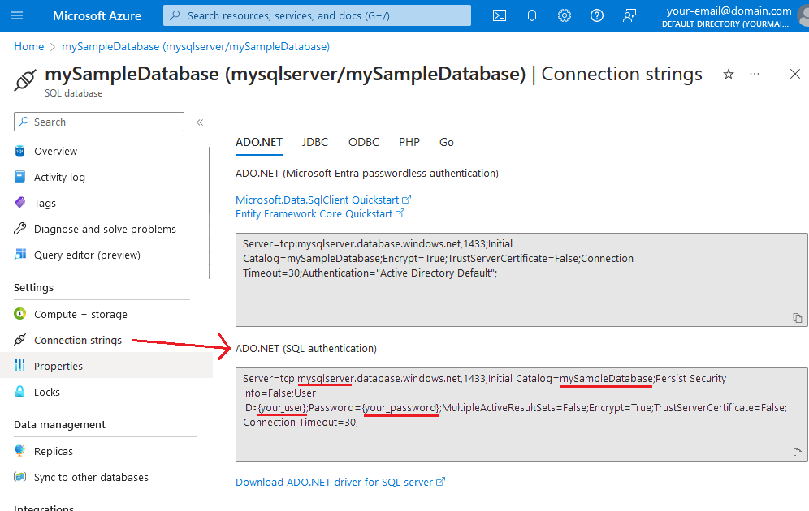

# ADO.NET Demo Console App

This is a demo console app that uses ADO.NET to connect to an Azure SQL Database populated with sample database data. It demonstrates basic CRUD (Create, Read, Update, Delete) operations on the `SalesLT.Address` table in the `AdventureWorksLT` database.

## Prerequisites

- Follow MS Learn's guide to create a SQL database and seed it with sample data: [Quickstart: Create a single database - Azure SQL Database](https://learn.microsoft.com/en-us/azure/azure-sql/database/single-database-create-quickstart?view=azuresql&tabs=azure-portal)
- SQL Server authentication details (Connection string)
- A system with dotnet sdk installed [Download .NET](https://dotnet.microsoft.com/en-us/download)


## Find Your Connection String

Go to [Azure Portal](https://portal.azure.com/)  
Click on "Connection string" in the left side menu bar  
Copy the connection string for SQL authentication  

Connection string is formatted like this:

```bash
Server=your_server;Database=AdventureWorksLT;User Id=your_username;Password=your_password;
```




## Configuration

1. **Clone the repository:**  
   ```bash
   git clone https://github.com/rezapps/ado.net

   cd ado.net

   touch appsettings.Development.json
   ```
2. **Add your connection string:**  
    open "appsettings.Development.json" and add your connection string:
    ```csharp
    {
        "Logging": {
            "LogLevel": {
                "Default": "Debug",
                "Microsoft": "Information",
                "Microsoft.Hosting.Lifetime": "Debug"
            }
        },
        "AllowedHosts": "*",
        "ConnectionStrings": {
            "DefaultConnection": "your-connection-string-here"
        }
    }
    ```
3. **Set Environment to Development:**  
    for powershell:
    ```cmd
    set DOTNET_ENVIRONMENT=Development
    ```

    for bash:
    ```bash
    export DOTNET_ENVIRONMENT=Development
    ```
4. **Run the app:**  
    ```bash
    dotnet run
    ```
